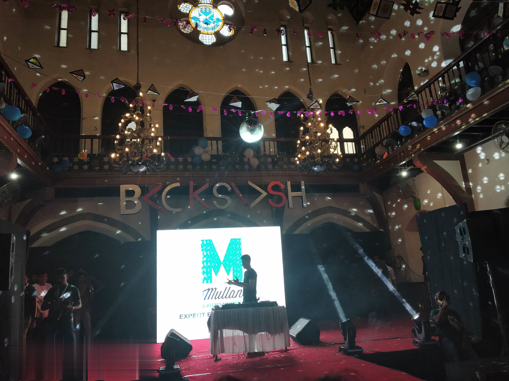
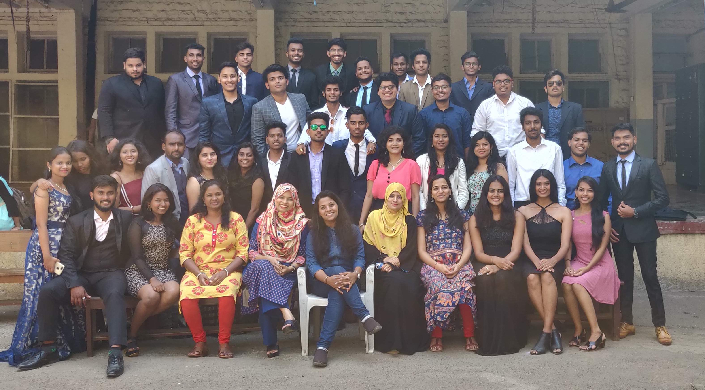
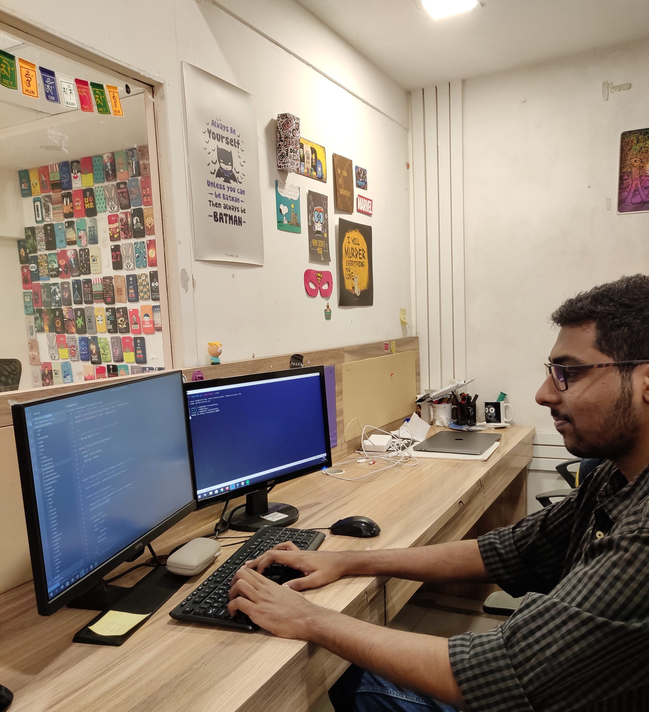

import Quote from '../../../src/components/blog/Quote.js'

<Quote
  phase="When faced with a choice, always choose the one that pushes you the most, increases your growth and personal prowess."
  cite="The 5 A.M Club"
/>

A lot of things changed this year from studying to transitioning to a professional career as a Front-End Developer. Overall this year had a lot of positives for me.

I had made some new year resolution for 2019 of things that I wanted to do like

- Developing my [portfolio site](https://jibin.tech)
- Starting my [personal blog](https://blog.jibin.tech). Both of the above, I planned to complete within the first 3 months, but it got extended by a month. It helped me to showcase my skill set and learned a lot during the process of development.
- Reading one book per month
- Regular Exercising

Most of the above, I completed except exercising regularly, but I intend to start again.

Some books that I read this year that I liked, and recommend you to read it if you haven't already are.

- **Permanent Record** - *Edward Snowden*
- **When Breath Becomes Air** - *Paul Kalanithi*
- **Robert Langdon series** (Origin, Angels & Demons, Da Vinci Code) - *Dan Brown*
- **Looking for Alaska** - *John Green*

### Events happened in 2019
Organized an IT departmental fest for my college. As an introvert, I had to do a lot of things that scared me like I had to interact with a lot of new people, manage a lot of things, handle timelines, etc. Made mistakes along the way, but in the end, it was a success. I'm glad that I did take up the role of coordinating the fest, it boosted my self-esteem.

Creating and deploying the [website for the fest](https://backslashfest.org) (might not be available, the domain will be expired soon 😓) gave me the confidence to start working on my portfolio site & blog.

### Starting this blog
I started my blog because I like to write about technical topics and to give clarity to what I learned over time. And in that process, if anyone finds the posts helpful, then it will be a bonus. I managed to write more than 14 this year from April.

I haven't got many views for my blogs, but some get dozens of view per week from organic searches like

- [Next.js + Redux](https://blog.jibin.tech/nextjs+redux/)
- [Integrating payment in your Android Application](https://blog.jibin.tech/integrating-payment-in-android-app/)
- [How to get started with IoT using NodeMCU Devkit and Firebase database](https://blog.jibin.tech/connecting-nodemcu-to-firebase/)

### Graduation

At the end of the first half, I had completed my graduation with good grades. During those 3 years of my life, I discovered things that I was passionate about, learned a lot, found a new hoppy,  & made some good friends.

### Next Phase in Life

Another big decision I made was not joining service companies after graduation from campus placements. I had offers from a couple of service-based MNCs, but I started applying for jobs on LinkedIn. The job search process was hectic for someone looking for his first job with tons of applications sent and never hearing back from the employers.

Around July, I started my professional career as a Junior Front-End Developer at [The Souled Store](https://thesouledstore.com) (it's an e-commerce startup).

Life is not always full of happiness, everyone has bad times, I had some, but I won't talk about that here.

### New Things I learned In 2019
#### Gatsby
I heard a lot about the gatsby hype and decided to try it. Having some knowledge about React was enough for me to start building my portfolio and blog with it. The overall experience of building static sites with Gatsby was ok with some rough edges, but documentation made more than up for it.

#### Redux
While learning React, I avoid Redux since I found it difficult to wrap my brain around. But, since the project at work was complex enough that without state management library like Redux, things would get complicated later on, I had no way out of this. As with everything, once I understood how Redux works, I want to use this everywhere, even though other solutions like context came out.

#### Email Templating
Developing email templates are hard. Not able to use modern CSS rather relying on HTML tables for creating email layout was a headache. Somehow, I managed to develop email templates without blowing my brains out.

#### Vue.js
After exploring the React framework, I wanted to try Vue.js just to know their difference, and why was it getting so much attention. So, I jumped on the Vue train and found many things way easier to achieve than in doing the same in React. Although, for some reason, I like React better.

#### Others
I'm passionate about web development, especially frontend, but I also try to explore things outside of that. I tried different things like Native Android development, AI, backend in Django, but nothing excited me much.

<figure class="figure w-25 m-auto figure--right">
 
 <figcaption class="text-center">
 <small>Edge AI Scholarship</small>
 </figcaption>
</figure>

I got an opportunity from Udacity to explore on Edge AI. I will be completing the initial course in the first quarter or another 4 months if I receive a scholarship for the nano-degree program.

### Things I Want To Learn/Do in 2020

- 🏋️‍♀️ Fitness (wasn't able to concentrate on it in 2019 but 2020 seems the year to start)
- 📖 I want to continue reading a book per month with different genres to find what I like the most. Having spent a lot of time watching TV series, I have to spare time to read books, which would of more use.
- ⌨️ Alteast one blog post per month on topics I have learned. 
- 💻 Make something (software related side-project in the first half of the year). I like developing things, so creating something for myself that can push my technical skills and learn new stuff along the way.
- 🏃‍♂️ Redesigning portfolio and blog. I have started working on moving my gatsby blog to use MDX instead of markdown. Reusable & interactive components are the way to go.
- 👷‍♂️ Advance topic in JS. Taking my Javascript skills to the next level by learning advanced concepts & unit testing in Javascript

Thanks for reading, hope 2020 brings you all the success in your life.

<Quote
  phase="Today’s accomplishments were yesterday’s impossibilities."
  cite="Robert H. Schuller"
/>

