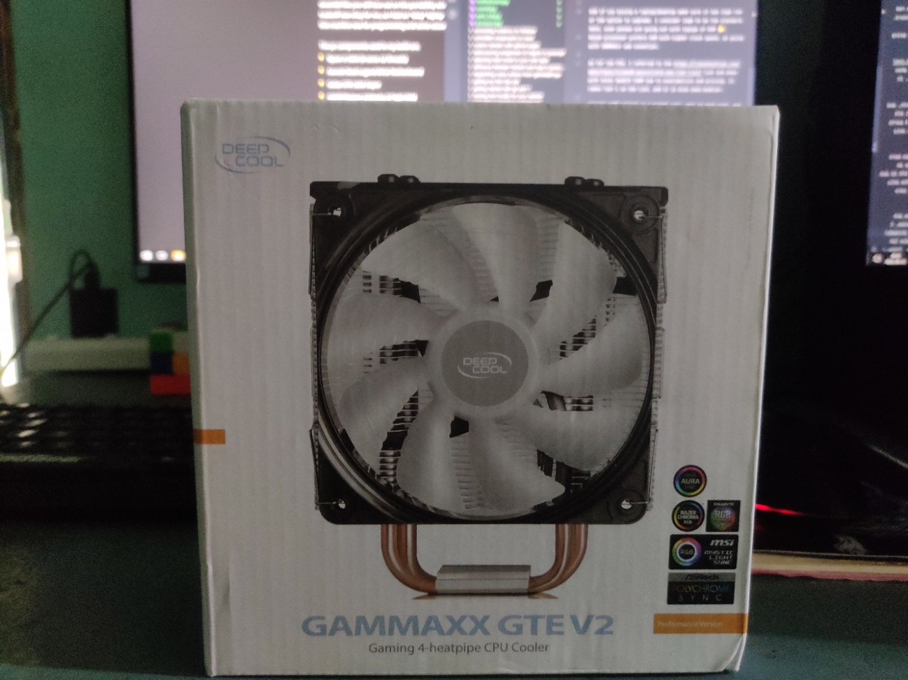
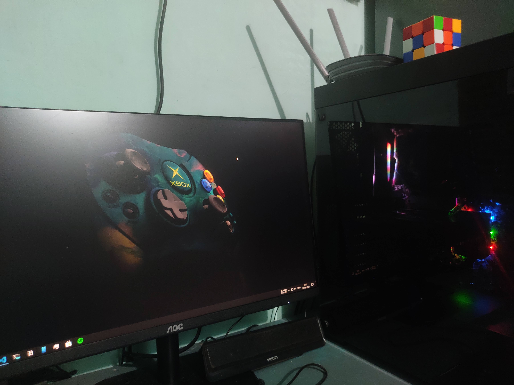

For a long time, I was considering building myself a workstation PC. And during the lockdown period, I found myself having the time to build it. The main deciding factor for choosing to build a PC was having the option of selecting components that satisfied my requirements and upgrading later down the line. And yes, it does have one major downfall like you will lose out on the portability when going with a desktop rather than a laptop. This tradeoff was okay for me, as I had an "okay" laptop when I need it on the go. The primary purpose of this machine was for programming and some casual gaming 🎮.

The pc components used in my build are.

- Ryzen 5 3600 (6 cores 12 threads)
- Asrock Steel Legend B450 Motherboard
- Galax GTX 1650 Super
- GSkill Ripjaws 3200mhz (2\*8gb) RAM
- Antec NeoEco 550W Semi-modular PSU
- Corsair 110R cabinet
- Adata 240gb SATA SSD
- Deepcool Gammaxx GTE V2 (I added this after building the pc because the cooler that came with the processor was not adequate to cool the processor)
- 1TB WD Blue (I already had this lying around)

Currently, AMD offers better value for money on the mid-range, and going with Ryzen 5 3600 was a no brainer. It has six core and twelve threads processor and will hold up strong with years to come.  
Another factor of going with AMD instead of Intel is that you have the added benefit of overclocking RAM and processor with lower end B series motherboard as well. On the Intel side, you have spent more to get the same.

I desired to buy the newer B550 motherboard or the MSI B450 tomahawk Max, but they had inflated pricing due to lockdown. And I settled on ASRock Steel Legend B450 instead.

Going all out for the GPU didn't make sense, as I will only be casually gaming. The NVIDIA GTX 1650 Super has good performance to price ratio. And it can run current modern AAA titles with ease (you may have to drop to medium settings on some games).

If you are buying a PC, make sure it has a 16gb RAM or a DIMM slot to upgrade. I consider 16gb to be the standard now. Heck, even phones are launching out with 16gigs of RAM 😂.  
Ryzen processor prefers RAM with higher clock speed, so going with 3000mhz+ was essential.

As for the PSU, I referred to the https://linustechtips.com/main/topic/1116640-psucultists-psu-tier-list/ list and went with Antec NeoECO 550M due to availability and pricing. It is an 80+ bronze certified power supply and ranks Tier C on the list, and it is also semi-modular.

Corsair 110R cabinet is a budget case, easy to work with, and plenty of space to route the cables. It can fit a full ATX motherboard and has an acrylic front panel and 2 USB 3 ports at the top. My only problem with this case is that it only comes with one case fan.

Ryzen 5 3600 already comes with a CPU cooler, temps were pretty much high even during medium workloads, so I had to buy an aftermarket cooler. I went with Deepcool Gammaxx GTE V2, and it is doing a damn good job than the stock cooler. It has an RGB fan (not that I'm going to turn it on).

I suggest using SSD (if you don't have it already) as the bootable drive. It will make your system a whole lot responsive.

I'm happy with how the build turned out. The only difficulty I faced during the assembling the system was in the installation of the aftermarket cooler due to the vague manual and had to spend 2hours to make it work.

