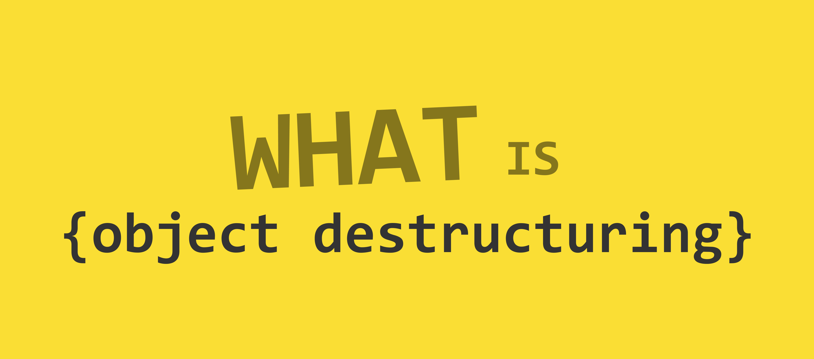

import Defination from '../../../src/components/blog/Defination.js'



ES6 provides a lot of new features like classes, arrow functions, string interpolation, promises, and many more. But one of my more liked features in ES6 specification is the array and object destructuring assignment.

<Defination>
Destructuring assignment syntax is where you unpack values from arrays or properties of object into variables names.
</Defination>

Assigning variables from array/object properties can be done in ES5, but it would take more lines of code to achieve the same. Also, a bit difficult to read when you want many properties from an object.

This post discusses object destructuring in javascript.

### Let's look at an example

_Getting object properties in variables using ES5 and ES6 destructuring syntax_

```js
var user = {
  firstname: 'Jibin',
  lastname: 'Thomas',
  email: 'jibin.thomas2706@gmail.com',
  twitterId: '@real_jibin',
}

// Older javascript
var firstname = user.firstname
var lastname = user.lastname
var email = user.email
var twitterId = user.twitterId
```

A lot of typing!!! ¯\\\_(ツ)\_/¯. Yea, I'm lazy. Now with ES6 object destructuring, the code is a lot more compact.

```js
// with object destructing operator
const { firstname, lastname, email, twitterId } = user
```

So in the above example, the variables (firstname, lastname, email, and twitterId) are created, but the values are obtained from the user object.

In the object destructuring syntax, we are taking object properties from RHS and assigning it to the variables on LHS. If there is no object property with the variable name, variables are **undefined**.

### Reassigning object property with a different variable name

Most of the time, having variable names identical to the object property name will serve the conditions. But in some instances, it won't fit well. Like occasionally, the property's names may not carry the meaning of its use. Also, the variable name could already be someplace else inside the code, in such situation reassigning to different variable name come to the aid. Reassigning object properties to different variable names can be done in the same line as object destructuring.

```js
// instead of
const { firstname, lastname, email, twitterId } = user
const first = firstname

// this also works
const { firstname: first, lastname, email, twitterId } = user
console.log(first) // Jibin
```

### Default values while object destructuring

What if the object properties do not exist, we may not want the variables to be undefined. In this case, you can assign a default value using `=` sign after the variable. Assigning default values helps in preventing undefined variable errors.

```js
const { middlename = '', projects = [] } = user
console.log(middlename) // ''
```

### Default values + Variables reassigning

Why not, you can do both of the stuff together.

```js
const { firstname: first = null } = user
```

---

Getting values from objects is a general thing you will do while using javascript, so you would be using object destructuring quite often. Object destructuring syntax makes your code more readable and looks elegant. And, this feature is supported in all major browsers. Check [browser support stats](https://caniuse.com/#feat=mdn-javascript_operators_destructuring).
