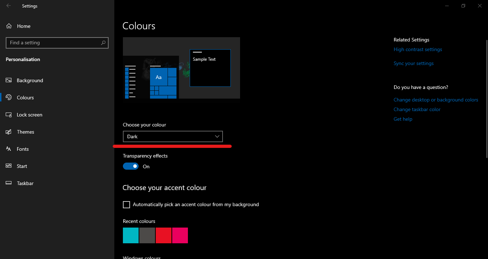

Back in the 1970s, when there was no GUI, all you had was a black terminal to interact with the computer. Even with the rise of www, the web pages contained mainly black text with a white background.

Nowadays, we still find the pattern of using dark text with light backgrounds.


But the trend is going towards using light text with a dark background or at least providing some sort to enable it. We are noticing a push from operating systems implementing dark mode. Major operating systems like Android, iOS, Windows 10 have already had this feature to some extent. Also, popular applications have started with having the dark mode feature available to the user.

<figure class="figure m-auto w-75">
    
    <figcaption class="text-center">
        <small>Windows 10 dark mode</small>
    </figcaption>
</figure>

<br />
<figure class="figure m-auto w-75">
    
    <figcaption class="text-center">
        <small>Slack dark mode</small>
    </figcaption>
</figure>

### Why dark mode?

This is essential because the way we use display devices is very different than we did a decade back. We are spending a lot of time in front of the screen at night.


<br />

Lately, many mobile manufacturers have been using AMOLED screens, which also helps save battery life in dark mode. So you get multiple benefits 🙌.

### Implementing in CSS

**What if I say that you can implement dark mode with built-in CSS?**

Yes, with media queries. It can do a lot more than responsive designs.

With the `prefers-color-scheme` in the [media queries Level 5](https://drafts.csswg.org/mediaqueries-5/#descdef-media-prefers-color-scheme), it helps you to set styles according to the user preference.

It provides 3 values to set styles to

- no-preference - when the user hasn't set any color preference
- light - when the user has set light color preference (light background with dark text)
- dark - when the user has set dark color preference (dark background with dark text)

The syntax for using it will be

```css
@media (prefers-color-scheme: light) {
  .selector {
    background: white;
    color: black;
  }
}

@media (prefers-color-scheme: dark) {
  .selector {
    background: white;
    color: black;
  }
}
```

### Easter egg

<style>
    .preference {
        background: red;
        padding: 0.5rem;
    }

    @media (prefers-color-scheme: light) {
        .preference {
            background: green;
        }
    }

    @media (prefers-color-scheme: no-preference) {
        .preference {
            background: yellow;
        }
    }

    @media (prefers-color-scheme: dark) {
        .preference {
            background: blue;
        }
    }

</style>

<p class="preference">
    Depending on the color preference of your system, the background will be set.
</p>

<div class="info-bar">
Red : if your browser doesn't support prefers-color-scheme <br />
Green : if preference is set to light <br />
Yellow : if no preference is set <br />
Blue : if preference is set to dark
</div>

### Fallback

As of now, not all browser supports prefers-color-scheme media query, so a fallback for the styles are necessary. It can as simple as writing a default set of styles for browsers that don't support it and adding media queries for the browser that supports.

Check browser support for [prefers-color-scheme](https://caniuse.com/#search=prefers-color-scheme)

```html
<div class="test">
  <h1>Hello world</h1>
</div>

<style>
  .test {
    color: red;
  }

  /* overriding styles of browser that supports this feature */
  @media (prefers-color-scheme: dark) {
    .test {
      color: white;
      backgroud: black;
    }
  }
</style>
```

### Detecting prefer-color-scheme using Javascript

Another pattern of loading styles based on user color preference would be detecting it in javascript and loading appropriate CSS files according.

That would require creating 3 CSS files, which will be base.css, light.css, and dark.css. Where the base.css contains all the styles as if the browser doesn't support the `prefers-colors-scheme` media query, whereas dynamically downloading light.css and dark.css file.

The benefit of this approach over simply using `@media (prefers-color-scheme)` in a single stylesheet is that you won't be downloading unwanted styles for the client (increasing the downloading time). For the most part, you should not have to bother about this unless you are loading a ton of styles.

```js
// Detecting if the browser supports prefers-color-scheme
if (window.matchMedia('(prefers-color-scheme)').media !== 'not all') {
  console.log('prefers-color-scheme supported')
}

// Checking user's color preference
if (window.matchMedia('(prefers-color-scheme:dark)').matches) {
  //   load dark.css
}
if (window.matchMedia('(prefers-color-scheme:light)').matches) {
  // load light.css
}
```

### Conclusion

Catering to the color requirements for the user is a great way for the progressive enhancement of your web app. Although having dark mode is a stylistic preference for the user, so having an option for disabling it will further enhance the user experience.
