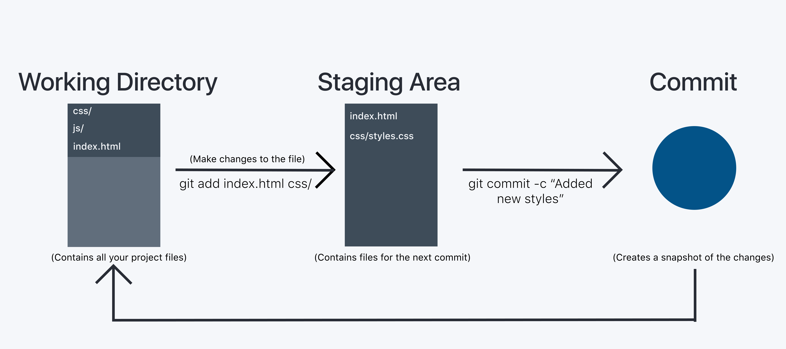

_This post is for total beginners who haven't heard or used any version control system or git._

Git is the most popular version control system out there. And there is a high chance you will be using it in your software development jobs as well. So it is essential to learn git if you are a developer. For me, it is something that took me very little time to learn but provided me a lot of value.

For those, you don't know what git is <br />
<div class="code-line">
    Git is a free and open-source distributed version control system designed to handle everything from small to very large projects with speed and efficiency.
</div>

In simpler terms, it helps to manage different versions of your code efficiently and also improves collaboration when working with many people efficiently.

<hr />

How many of you keep/ had to keep your projects like this or similar to this pattern?


Hahaha, I was one of them until I learned how to use git. You don't need to know everything about git when starting to use it in your projects. You can do a lot of powerful stuff using git, but when you start, you need 4-5 commands and learn as situations arise. 

If you have not installed git, then go ahead and install it. Follow the instructions in this post about [installing git](https://git-scm.com/book/en/v1/Getting-Started-Installing-Git).

### Git workflow



The basic Git workflow goes something like this:

1. You modify data in the working directory.
2. You stage the files, adding snapshots of them to your staging area (Only the staged files will be committed).
3. You commit, which takes the files from the staging area and stores it as a snapshot permanently to your Git directory.

<hr />

### Commands

**git init**
<br />
This command initializes the directory in which it executes as a git repository. Mostly, you will be running "git init" as the first command except when the project is already initialized.

It adds a .git folder into that directory. Git directory stores all the changes, commit history and all other stuff so don't delete or modify any content within it.

```bash
cd my-project/
git init
```

<br />

**git add**
<br/>
It adds the changed files to the staging area. You can add multiple files and folders all together at once by appending their path after the git add command.
You can also use "." as a wildcard to add all the changed files to the staging area.

```bash
git add styles/
git add index.html contact.html
git add .
```

<br />

**git status** 
<br />
It gives information about the status of the files in your git repository. Whether the files have been added, updated, removed, renamed, and the staged files.

Tip: check the git status command before you commit

<br />

**git commit**
<br />
It permanently stores the changes made to the files in the staging area. You can relate to it as a checkpoint in a game.

Once you commit the changes, you can revert to this checkpoint anytime you want.

You can use -m flag to write your commit message inline.

```bash
git commit -m "initial commit."
```

<br />

**git log**
<br />
It gives you the commit history with all the previous commit messages.

<br />
<hr/>

Start using these commands in your projects. At first you might struggle with it, but eventually, it will become second nature for you.

I have made a shorter version in a [pdf for quick reference](reference.pdf).

There will second part of this post which will address topics on branching, and working with remote repositories.
