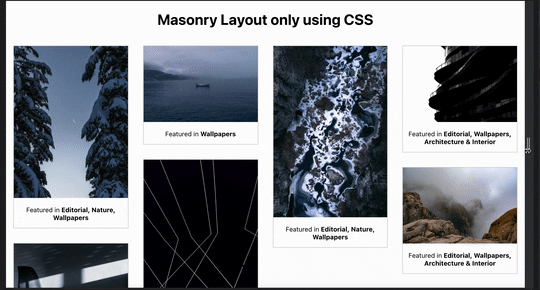

Masonry layout is a popular technique that involves arranging items in a staggered grid (e.g., Pinterest). While I was looking to build a masonry layout, I found a couple of solutions that involved using libraries like [Masonry](https://masonry.desandro.com/) & [MiniMasonry](https://spope.github.io/MiniMasonry.js/). These required using Javascript, but I believe most of the layout should be created using CSS with minimal JS code. So in this post, I will highlight how to implement masonry layout using only CSS.

CSS now has a native way to build masonry layouts using CSS Grids. But it is only available behind a flag on Firefox. It will take some time to land in all the browsers. So we will be using this along with column layout as a fallback.

## Code
First, let's create the HTML template.

```html
<div class="container">
  <div class="masonry-item">
    <!-- add elements here  -->
  </div>

  <div class="masonry-item">
    <!-- add elements here  -->
  </div>
</div>

```

Here we will be applying styles to the `container` class. 

We will be checking if the browser supports particular CSS property using a feature query that uses the at-rule `@supports`. So we can check if the browser supports `grid-template-rows: masonry` and load those styles.

```css
.container {
  --masonry-columns: 4;
  --masonry-gap: 1rem;
}

@supports (grid-template-rows: masonry) {
  .container {
    display: grid;
    grid-template-columns: repeat(var(--masonry-columns), 1fr);
    grid-gap: var(--masonry-gap);
    grid-template-rows: masonry;
  }

  .container > * {
    margin-bottom: 0;
  }
}
```

I'm using CSS custom properties for defining the number of columns and spacing between each masonry cell. It will help us in
- Using the same variables for the main layout and the fallback.
- We can change the custom properties value in the media query for responsive layout.

```css
@media (min-width: 630px) {
  .container {
    --masonry-columns: 2;
    --masonry-gap: 0.5rem;
  }

}
```

Bamn, now we have 2 column masonry layout on-screen sizes less than 630px.


Since `grid-template-rows: masonry` won't work on most browsers, we need an alternate way to create the masonry layout. Here, we will use the CSS column layout as a fallback.

```css
/* fallback */
.container {
  column-count: var(--masonry-columns);
  column-gap: var(--masonry-gap);
}

.container > * {
  margin-bottom: var(--masonry-gap);
  break-inside: avoid;
}
```




Here's the [link to the codepen](https://codepen.io/jibin2706/pen/bGYBrQQ) to try it out.


