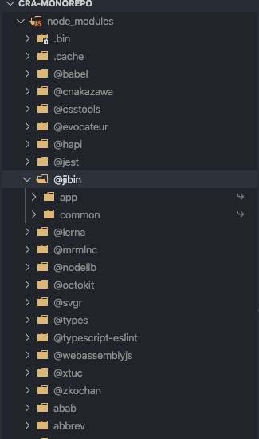

With react's component architecture, it makes it very easy to create a shared component library that we can then reuse across different projects. One thing that makes it easier is the colocation of the component library inside the project. But it lacks reusability across other projects. I last thing you want is to copy-paste code across projects, as it becomes an overhead once you start changing or adding components.

So you have two ways to tackle this problem.

- Create a separate project of the component library and publish it to npm
- Monorepo with component library

The choice depends on what you want to achieve and what kind of flexibility you need.

Here's a reference to know more about [publishing react library to npm](https://itnext.io/create-and-publish-a-react-component-library-the-easy-way-6d1798974bc6).

For this post, I will be showing you how to set up a project with the create-react-app and a shared component package. We will be using yarn workspaces for managing our monorepo. Learn more about [yarn workspaces](https://classic.yarnpkg.com/en/docs/workspaces/).

### Setting up the project structure for monorepo

On the root of the project, create a package.json file with the following config.

```json
// package.json
{
  "name": "Project Name",
  "private": true,
  "workspaces": ["packages/*"]
}
```

`"workspaces": [ "packages/*"]` indicates that all the direct directories inside packages with a package.json should be considered a project. It is a convention to store all the projects inside `packages/` in monorepo, you can change it as per your needs.

Here's a rough directory structure of how the monorepo will look.

```
.
└── monorepo/
    ├── node_modules/
    ├── packages/
    │   ├── app/ (create-react-app)
    │   │   ├── src/
    │   │   └── package.json
    │   └── common/ (shared component library)
    │       └── components
    │       └── package.json
    ├── package.json
    └── yarn.lock
```

### Installing CRA and shared component library

```bash
cd packages
npx create-react-app app

mkdir common
cd common
touch package.json
```

```json
// packages/common/package.json
{
  "name": "@jibin/common",
  "version": "0.0.1",
  "private": true
}
```

**Naming packages with @{domain}/{package-name} will group all the packages inside one common folder in node_modules. It allows for easier debugging if something some packages are not working properly or some else goes wrong. In my case, I have renamed the `name` key in the app package as @jibin/app.**

### Installing dependencies

From the root of the project, install the dependencies using yarn install.

```bash
yarn install
```

It will install all the dependencies across all the packages into the root. You can then check the root node_modules folder to locate your package.



### Transpiling JSX into js from the shared component package

As we are not transpiling (converting JSX into createElements) from our shared components package, we will rely on cra to do the transpilation step. It makes the process a whole lot easier. To do so, we have to customize babel by using `react-app-rewired` and `customized-cra` packages. It allows you to customize webpack configuration without ejecting react-scripts.

### Installing and configuring react-app-rewired and customized-cra

```bash
yarn workspace @jibin/app add -D react-app-rewired customized-cra
```

```json
// packages/app/package.json
"scripts": {
-   "start": "react-scripts start",
+   "start": "react-app-rewired start",
-   "build": "react-scripts build",
+   "build": "react-app-rewired build",
-   "test": "react-scripts test",
+   "test": "react-app-rewired test",
    "eject": "react-scripts eject"
}
```

Now we can override babel config by creating the config-overrides.js file in the app package.

```js
var path = require('path')

const { override, babelInclude } = require('customize-cra')

module.exports = function (config, env) {
  return Object.assign(
    config,
    override(
      babelInclude([
        /* transpile (converting to es5) code in src/ and shared component library */
        path.resolve('src'),
        path.resolve('../common'),
      ])
    )(config, env)
  )
}
```

It instructs babel to transpile all the files in the app's src directory and shared component package.

So that's it, now you can create component inside `common/` and import inside app package.

Example

```js
// import ComponentName from 'package-name/<directory>/<file-name>'
// In the demo package name is @jibin/common, and file is directly inside the package
import ComponentName from '@jibin/common/Test'
```

### Tooling

This step is not mandatory, but it makes the developer experience a whole lot better. To enable IntelliSense, create jsconfig.json in the app package with the following configuration.

```json
{
  "compilerOptions": {
    "baseUrl": ".",
    "paths": {
      "@jibin/common/*": ["../common/*"]
    }
  },
  "exclude": ["node_modules"]
}
```


### Example

The [monorepo template is available here](https://github.com/jibin2706/cra-monorepo-demo), if you want to try out the completed demo or build on top of it.

### Reference

The issue regarding monorepo in the create-react-app's [GitHub repository](https://github.com/facebook/create-react-app/issues/1333).
