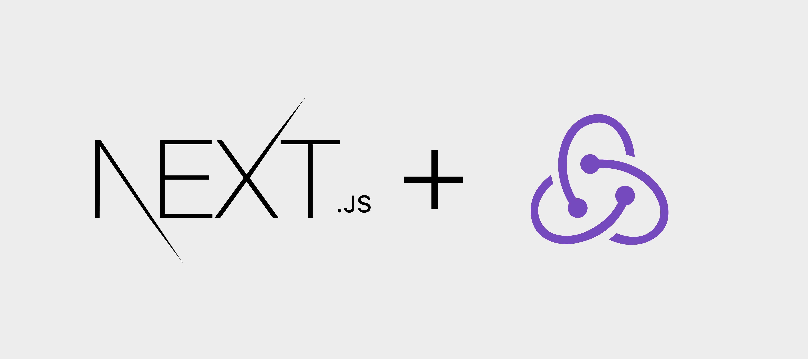
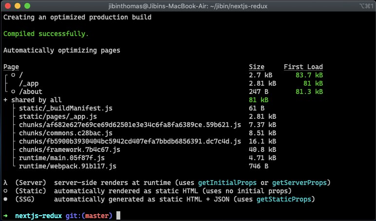

I had written a post about integrating Nextjs with Redux a few months back, but it had one downside. Static prerendering was not possible using that method even though you didn't use getInitialProps in the page components.

Here's a link to the previous [post](https://jibin.tech/nextjs+redux), if you are interested in having a look at it.

Static prerendering allows you to generate files in build time rather than running a server. So faster page load, since there are static files and can be cached at CDN.

The difference between the early version is that we will be using the Redux higher-order component not in the _app.js file but on the page components that require redux. For achieving this, there are few tweaks made to the redux higher-order component.


---

Let's follow through the instruction by setting up a new project.

```bash
 npm init -y
 npm install react react-dom next redux react-redux react-thunk
 
 # Optional package
 npm install redux-devtools-extension
```


### Configuring Redux in Nextjs


_This wrapper file is taken from next.js Github repository_

```js
// /lib/with-redux-store.js
import React from "react";
import { Provider } from "react-redux";
import initializeStore from "../src/store";
import App from "next/app";

export const withRedux = (PageComponent, { ssr = true } = {}) => {
  const WithRedux = ({ initialReduxState, ...props }) => {
    const store = getOrInitializeStore(initialReduxState);
    return (
      <Provider store={store}>
        <PageComponent {...props} />
      </Provider>
    );
  };

  // Make sure people don't use this HOC on _app.js level
  if (process.env.NODE_ENV !== "production") {
    const isAppHoc =
      PageComponent === App || PageComponent.prototype instanceof App;
    if (isAppHoc) {
      throw new Error("The withRedux HOC only works with PageComponents");
    }
  }

  // Set the correct displayName in development
  if (process.env.NODE_ENV !== "production") {
    const displayName =
      PageComponent.displayName || PageComponent.name || "Component";

    WithRedux.displayName = `withRedux(${displayName})`;
  }

  if (ssr || PageComponent.getInitialProps) {
    WithRedux.getInitialProps = async context => {
      // Get or Create the store with `undefined` as initialState
      // This allows you to set a custom default initialState
      const reduxStore = getOrInitializeStore();

      // Provide the store to getInitialProps of pages
      context.reduxStore = reduxStore;

      // Run getInitialProps from HOCed PageComponent
      const pageProps =
        typeof PageComponent.getInitialProps === "function"
          ? await PageComponent.getInitialProps(context)
          : {};

      // Pass props to PageComponent
      return {
        ...pageProps,
        initialReduxState: reduxStore.getState()
      };
    };
  }

  return WithRedux;
};

let reduxStore;
const getOrInitializeStore = initialState => {
  // Always make a new store if server, otherwise state is shared between requests
  if (typeof window === "undefined") {
    return initializeStore(initialState);
  }

  // Create store if unavailable on the client and set it on the window object
  if (!reduxStore) {
    reduxStore = initializeStore(initialState);
  }

  return reduxStore;
};

```

You can use the above snippet at each page that requires a connection to the redux store. But a better way to achieve this would be to wrapping Redux HOC with a common Layout component, which will a wrapper around all the pages.

We will be wrapping the Layout component in the _app.js file, which will be used across all the pages. 

```js
// \src/components/Layout.js
import React from "react";
import { withRedux } from "../../lib/with-redux-store";

function Layout({ children }) {
  return <div>{children}</div>;
}

export default withRedux(Layout);
```

```js
// \pages/_app.js
import App from "next/app";
import React from "react";
import Layout from "../src/components/Layout";

class MyApp extends App {
  render() {
    const { Component, pageProps } = this.props;
    return (
      <Layout>
        <Component {...pageProps} />
      </Layout>
    );
  }
}

export default MyApp;
```

It allows keeping the state when navigating between pages as it wraps the Layout component, which will be available on all the pages with withReduxStore higher-order function.

Unlike in a single-page application, we will return the initialize store function instead of the store itself.

```js
// /src/store.js
import { createStore, applyMiddleware } from "redux";
import { composeWithDevTools } from "redux-devtools-extension";
import thunk from "redux-thunk";
import rootReducer from "../src/reducers";

export function initializeStore(initialState = {}) {
 return createStore(
  rootReducer,
  initialState,
  composeWithDevTools(applyMiddleware(thunk))
 );

```

Now all the components can have access to the redux store using connect function from react-redux.



From the above snippet, you can see that we were able to generate static pages of / and /about when using redux wrapper in the Layout component.

### Source code

Here's the source code if you want to try it out in your machine.

<div class="codeline not-prose">
 git clone https://github.com/jibin2706/nextjs-redux.git<br />
 cd next-redux-example <br />
 npm install <br />
 npm run dev<br />
</div>
