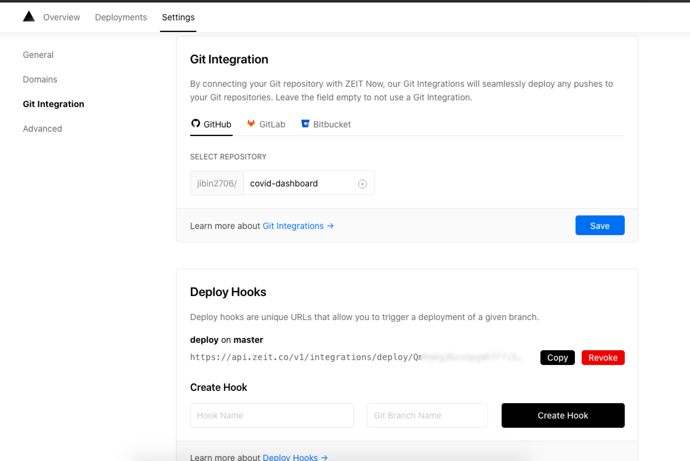
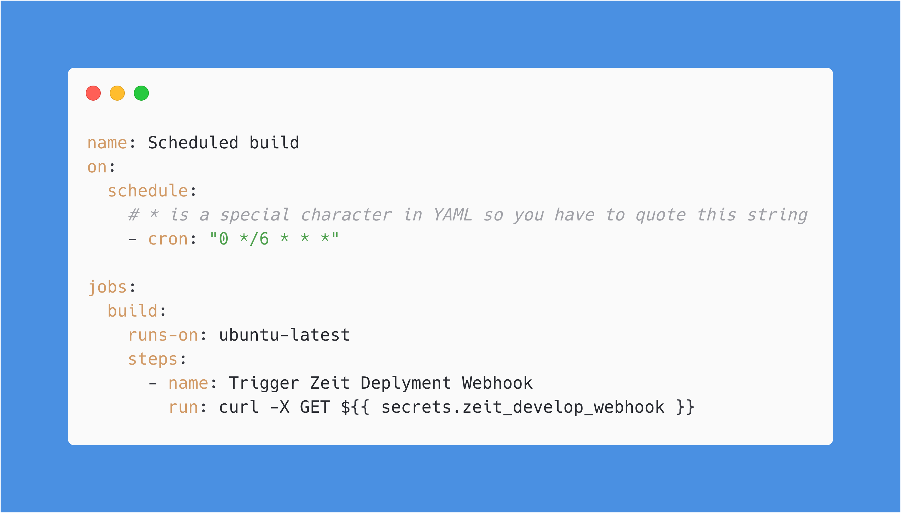

### What are Github Actions?

Github Actions allow creating workflow around the Github repository. For example, you can manage triggers to run tests, create software build after a merge, basically have your manage your entire CI/CD process from Github actions and many other cool things too.

Check this [Github repo](https://github.com/sdras/awesome-actions), which has examples curated by the community.

### Why Schedule builds

It's been a while since GitHub actions where announced, but I didn't have any use case to implement it any of my projects, until now 😅.

I had built a static site that shows COVID-19 stats, but most of the data it showcased was retrieved at build time rather than runtime. I didn't want the client to call more than 200 REST API calls (because the endpoint of all the countries where different). So, I needed to build and deploy the project after a definite time to make sure the stats data were not stale.

### Implementing Scheduled Builds

Well, the deployment part was taken care of by Zeit Now. Where I had deployed the project, and they offer a generous free plan. So I created a deploy webhook from Zeit's dashboard. Using the webhook, I can trigger the redeployment without any merge to the master branch, or going to the deployment dashboard.

Still, I have to visit the link to trigger a redeployment. And this is where GitHub's actions come to the rescue. It allows you to run tasks in ubuntu/mac/windows in their cloud platform.

The workflows that you create must be in the .github/workflows directory of your repository. I just had to write a YAML script that hits the webhook using curl and schedule that to run once every 6-hour using a cronjob.

<!-- prettier-ignore -->
Note: ${{ secrets.zeit_develop_webhook }} is a secret variable containing the webhook URL, to create secret variable go to   `Github Repo Settings > Secrets > Add a new secret`
