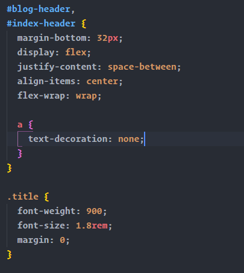

<small>Photo by Damian Zaleski on Unsplash</small>
 

As a web developer, I spent most of my time in the code editor, terminal, and in the browser. So having a good code editor will help increase productivity.

VSCode has been my preferred editor for the past year. Earlier, I used Sublime Text, but the ease of installing extensions, git integration, monthly updates, and various other features enforced me to switch to VSCode. Another plus is that it can be customized according to your liking by themes and icon packs.

If the features of VSCode are not enough for you, then you can easily extend it by installing extensions. These contain support for more languages, code snippets, themes, etc.
Extensions offer more features and can help you to become more productive while coding.

These listed plugins will help you be more productive.

### [Emmet](https://emmet.io/)

This extension comes bundled with VSCode, so installation is not required. Creating repetitive markup can be ineffective. This extension helps generate skeleton markup with the help of some shortcuts.

Pretty powerful right? Check the documentation and examples [here](https://docs.emmet.io/).

### [Auto Rename Tag](https://marketplace.visualstudio.com/items?itemName=formulahendry.auto-rename-tag)

It enables you automatically rename paired HTML tags, so no more searching for that distant ending tag. It also works with JSX. If you are coding HTML, then this extension is a must-have.

### [Prettier - Code Formatter](https://marketplace.visualstudio.com/items?itemName=esbenp.prettier-vscode)

Prettier helps you to format code with ease. Prettier allows you to format JavaScript, Typescript, and CSS preprocessors like Sass and LESS. You can enable the "format on save" option which formats the document on save.
Additionally, you can extend it by creating a .prettierrc file with rules of formatting which will help when working on a codebase with multiple developers. Also adopting a style guide will help settle the arguments such as tabs over space amongst the other.

### [Live server](https://marketplace.visualstudio.com/items?itemName=MS-vsliveshare.vsliveshare)

This extension helps to create a local development server. It can be used while developing a static site or even PHP.
You can access the server on the same local network.

### [VS Live share](<[https://marketplace.visualstudio.com/items?itemName=MS-vsliveshare.vsliveshare](https://marketplace.visualstudio.com/items?itemName=MS-vsliveshare.vsliveshare)>)

Pair programming can be fun, but what if your coding companion is someplace else, still you can do it using Live share extension.
It is a very intuitive process. You have to share the URL to get started.

You even can have a voice call using the [Extension Pack](https://marketplace.visualstudio.com/items?itemName=MS-vsliveshare.vsliveshare-pack)

### [Project Manager](https://marketplace.visualstudio.com/items?itemName=alefragnani.project-manager)

This extension allows quick switching between your projects from the editor itself. You can start the project without opening the file explorer, once it is added. Plus, it adds an icon on the workbench for easy access.

### [Bracker Pair Colorizer](https://marketplace.visualstudio.com/items?itemName=CoenraadS.bracket-pair-colorizer)

Finding matching brackets can be confusing😕? But not while using this extension.
It colors matching brackets to avoid confusion. This extension is highly recommended for all developers because what programming language does not have brackets?

Here's a gist to my [vscode settings](https://gist.github.com/jibin2706/fbae97aa9edffe634d0ea69cf505b365).
