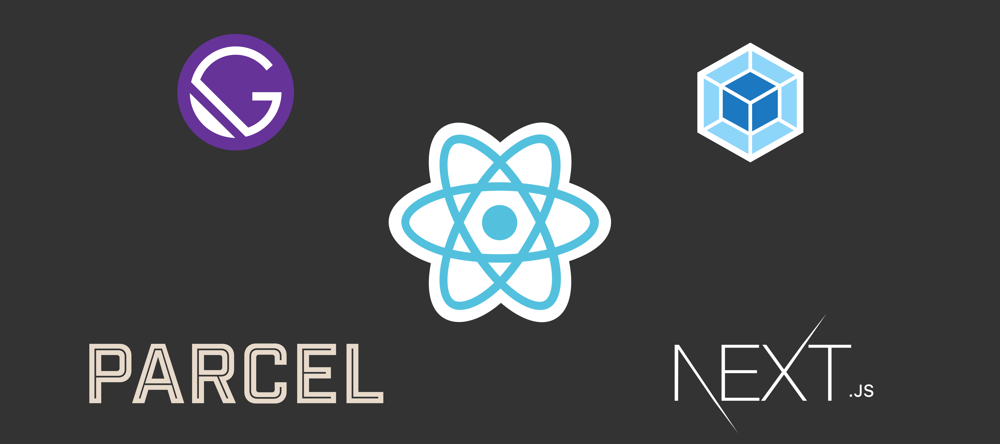

Beginners to react framework are overwhelmed by the amount of setup to be done before they start creating anything meaningful. According to your use case, you can opt-in for the method depending on what you want to achieve. Each of the packages/frameworks has specific areas where they shine.

If will want a quick example/demo online sites like codepen or codesandbox will help without any configuration. On the other part, if you are creating some big projects, you need to set up a local development environment and add required packages from npm/yarn.

There are many more open-source starter configurations for react, but create-react-app, gatsby, and nextjs are most popular among those.

### create-react-app

Facebook has created [create-react-app](https://github.com/facebook/create-react-app) package to make it easy to build react apps without Webpack or babel configurations. Once you need more customization to webpack configuration you can eject, which will give you more control. A lot of useful features come out of the box like autoprefixed CSS, integration of service worker for PWA's and many more.

**Setup Difficulty**: Easy  
**Easy of use**: Easy  
**Features**: SPA, Static sites  

### Next.js

[Nextjs](https://nextjs.org/) combines the power of single-page applications and server-rendered apps. Ideal when the website is dynamic and doesn't want to compromise on SEO and performance. Also, the first load on SSR is much faster than in the SPA. Nextjs uses the file system API for routes, so every file in the pages directory becomes a route, just like in PHP.
It also has the ability for static site generation, but gatsby is more suitable for that.

**Setup Difficulty**: Easy  
**Easy of use**: Easy  
**Features**: Server-side Rendering  

### Gatsby.js

[Gatsby](https://www.gatsbyjs.org/) is the best framework when you want to create static sites like blogs or portfolio sites that won't update very frequently. It generates static files on build time so the pages will be super fast. Also, gatsby has a good plugins ecosystem and integrates well with CMS like Wordpress, contentful, and various others using the GraphQL API. Getting familiar with the plugin ecosystem and GraphQL can we take some effort if you are new to these things.

**Setup Difficulty**: Easy  
**Easy of use**: Medium  
**Features**: Static sites, Plugin system  

### Creating configuration from scratch

Setting up the react environment from scratch can be very consuming, but you will have complete control of what packages are being installed and can modify them as per the requirements. Installing packages, configuring webpack/parcel can be difficult for beginners.

Here a post on [how to configure webpack for react](https://blog.logrocket.com/versatile-webpack-configurations-for-your-react-application-e6ebf6615cc/). 

**Setup Difficulty**: Hard  
**Easy of use**: Hard  
**Features**: Configure as per you needs  

### Conclusion

It comes down to what you want to achieve.

SPA - create-react-app  
SSR - Next.js  
Static Sites - Gatsby.js  
Custom Stuff - configuring yourself
