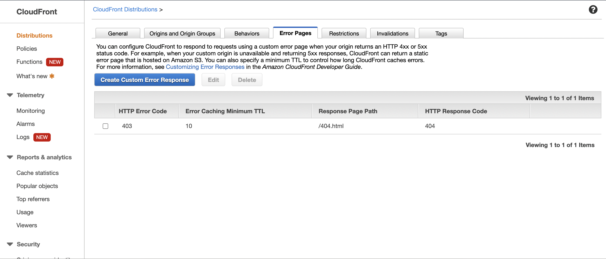
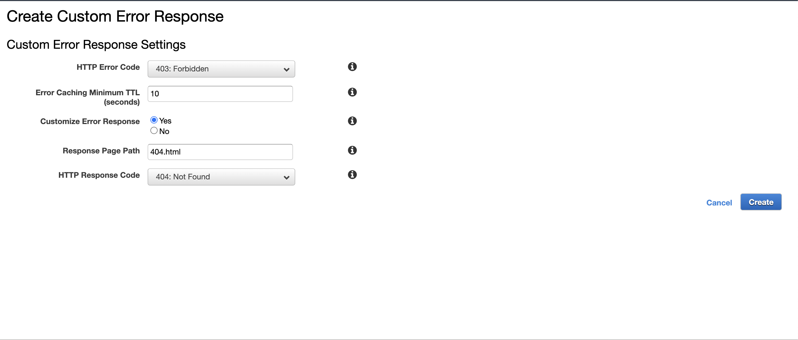

When deploying any Gatsby.js project using S3 and Cloudfront, the 404 page redirection by default happens with the 403 status code. This is done by S3 due to security reasons and this behavior can be changed from CloudFront by overriding error status codes.

From the `Error Pages` tab select `Custom Error Response`

Select Error Status Code from `403` to HTTP Response to `404`
Response Page Path as `404.html` (default in gatsby)

