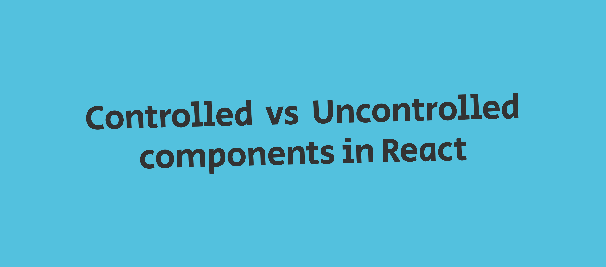

In this post, I will try to explain the difference between controlled components and uncontrolled components in React, and when you want to use those.

Creating forms in React requires a bit more setup than in traditional approaches like simply using HTML or even with other frameworks like Vue.js and others. In React, you have to attach an onChange event handler on the input field, which changes the state and attach that state to the value prop in the input element.

```jsx
// Uncontrolled input element
function Form() {
    const [name, setName] = useState('')

    const handleInputChange = (e) => {
        setName(e.target.value)
    }

    return (
        <form>
            <input type="text" value={name} onChange={handleInputChange}>
            <button>Submit</button>
        </form>

    )
}
```

Although, you could use just the input field directly without initializing a state or an onChange event handler. Just like in traditional HTML forms. But you will be losing out on things that you might want like interactivity.

### Form inputs in React can be approached in two ways

**Uncontrolled components**: Here, handling of the form data is done by the DOM itself. The input field's value gets updated without React having to do anything.

```jsx
 function UncontrolledForm() {
     return (
         <form>
             <input type="text" name="first_name">
             <button>Submit</button>
         </form>
     )
 }
```

**Controlled components**: Where the form input elements (input, textarea) triggers the onChange event handler when the user interacts with it. On which the onChange event handler sets a state which gets passed as props to the value attribute.

For the most part, you should rely on this approach, which the React documentation recommends. Unless you want to quickly create something, and want the ability to integrate with non-react code.

### Where you might want to use controlled inputs?

Some of the use cases of controlled that I can think of are:

1.  Instant form validations (Eg. comparing confirm password with password field)
2.  Dynamic inputs (Eg. Changing user input to uppercase )
3.  Instant preview (Eg. Creating markdown preview from the user input)

All the above cases can be achieved using vanilla javascript, but controlling it by the state provides a simple and elegant way to do so. Having easy access to the input values allows you to develop interactive forms with a great user and developer experience.
