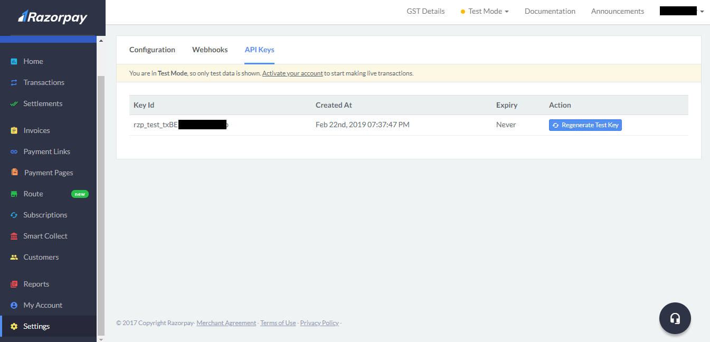

There might be instances when you want to accept payment from the users and the best way to do it by integrating a payment service provider. There are more than 900 payment providers in the world. Some of the more popular ones are PayPal, Stripe, Paytm, etc. For small business owners and startups, relying on off-the-shelf payment service will serve better in terms of security, time, and money instead of developing their own.

## What are payment service providers?

According to Wikipedia, a payment service provider (PSP) offers shops online services for accepting electronic payments by a variety of payment methods including credit card, bank-based payments such as direct debit, bank transfer, and real-time bank transfer based on online banking. Typically, they use a software as a service model and form a single payment gateway for their clients (merchants) to multiple payment methods.

This post demonstrates how to use Razorpay Android SDK to implement payments in your android app.

## Why RazorPay instead of other payment gateways?

There are many reasons to use RazorPay instead of some other payment gateways. Some of those reasoning being

1. No setup or maintenance fee
2. Testing in private mode
3. Support for all the platforms
4. Various payment options such as UPI, credit or debit card, mobile wallets, etc
5. Intuitive Design for payment
6. Good Documentation
7. Multiple currency transactions

## Getting started

1.  You need to first create an account on Razorpay. If it already exists then login to [Razorpay](https://razorpay.com/)

2.  From the Settings option from the dashboard, you can find the API key.

    **Note: Don't disclose this API key**
    

3.  Razorpay dependency should be added to build.gradle file. It will then download the required packages need for the payment.

    **Note: The minimum Android SDK version is 19 although it can be changed**

    ```
     repositories {
         mavenCentral()
     }
     dependencies {
         implementation 'com.razorpay:checkout:1.5.2'
     }
    ```

4.  Add the Razorpay API key generated in the second step in the Android Manifest

    ```xml
     <meta-data
             android:name="com.razorpay.ApiKey"
             android:value="YOUR_API_KEY" />
    ```

5.  Implementing PaymentResultListener / PaymentResultWithDataListener interface <br/>
    If you want the payment details such as payment id, email and mobile number of the user, and various options that are passed to the checkout object like the amount, merchant name, description, etc at the end of the transaction you should use PaymentResultWithDataListener if not then PaymentResultListener should suffice.

    **onPaymentSuccess** and **onPaymentError** are abstract methods that must be implemented and called when the transaction is successful or failed respectively.

    ```java
    // PaymentResultListener
    public class MerchantActivity extends Activity implements PaymentResultListener {
      // ...
      @Override
      public void onPaymentSuccess(String razorpayPaymentID) {
         // Add your logic here for a successful payment response
      }

      @Override
      public void onPaymentError(int code, String response) {
        //  Add your logic here for a failed payment response
      }
    }
    ```

    ```java
    // PaymentResultWithDataListener
    // It contains PaymentData object in the onPaymentSuccess method
    public class PaymentActivity extends Activity implements PaymentResultWithDataListener {
        @Override
        public void onPaymentSuccess(String razorpayPaymentID, PaymentData paymentData) {
            Toast.makeText(getApplicationContext(), "success", Toast.LENGTH_SHORT).show();
            ...
      }

        @Override
        public void onPaymentError(int i, String s, PaymentData paymentData) {
            Toast.makeText(getApplicationContext(), "failure" + s, Toast.LENGTH_SHORT).show();
            ...
        }
    }
    ```

6.  This step is optional and will help faster rendering of the checkout page on slower network connections. You can preload the checkout Activity in any of the previous activities.

    ```java
    public class SomeEarlierMerchantActivity extends Activity {
        public void onCreate(Bundle savedInstanceState) {
            super.onCreate(savedInstanceState);

            // Preload payment resources
            Checkout.preload(getApplicationContext());
         }
     }
    ```

7.  For initiating the payment, an instance of a Checkout object with payment details and options as a JSONObject object should be passed. <br />
    **Note: The JSONObject object must contain name, currency & amount values.**

    ```java
    public void startPayment() {
        Checkout checkout = new Checkout();
        final Activity activity = this;

        try {
        JSONObject options = new JSONObject();

        options.put("name", "Merchant Name");
        options.put("description", "Description of the order");
        options.put("currency", "INR");
        /**
         * Amount is always passed in PAISE
         * Eg: "500" = Rs 5.00
         */
        options.put("amount", "500");

        checkout.open(activity, options);
           } catch(Exception e) {
               Log.e(TAG, "Error in starting Razorpay Checkout", e);
           }
    }
    ```

Hurray! Now you can accept payments.

Here's a [sample app](https://github.com/jibin2706/RazorPayment-Demo) using Razorpay API. Make sure to add API key in the AndroidManifest.xml file else the app will crash.

For more information, here's the [official documentation](https://razorpay.com/docs/payment-gateway/integrations-guide/mobile/android/standard/).
